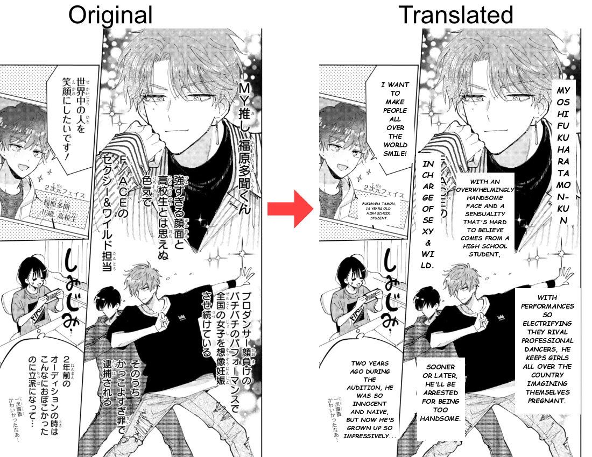

# OCRMangaTranslator

A pipeline for OCR-ing Japanese text from manga/comic images, translating it to English via an LLM API, and overlaying the translated text back onto the images.

## Pipeline Overview

The project processes images in three sequential steps:

```
Input Images (PNG)  →  [1. OCR]  →  JSON Results  →  [2. Translate]  →  Translated JSON  →  [3. Draw]  →  Final Images
```



### Step 1: OCR — `run_ocr.py`
Uses **PaddleOCR** (`PaddleOCRVL`) to detect and extract Japanese text from PNG images. Results are saved as JSON files containing text blocks with bounding box coordinates.

### Step 2: Translate — `translate.py`
Sends extracted Japanese text to an LLM API (via OpenRouter) for English translation. Supports:
- **Conversation history** — maintains context across text blocks within an image for consistent translations
- **Dictionary lookup** — applies custom translations from `note.txt` before sending to the LLM
- **Retry logic** — retries up to 3 times if the translation doesn't start with ASCII characters
- 
- Translated results are saved alongside the original JSON as `*_translated.json`

### Step 3: Draw — `draw.py`
Reads the translated JSON, erases the original Japanese text (by drawing white rectangles over text blocks), and renders the English translation with:
- **Auto-fitting font size** — shrinks text to fit within the original bounding box
- **Word wrapping** — handles both normal and narrow (vertical text) layouts
- **Centered text** — horizontally centered within each block
- **Comic-style font** — uses `comicz.ttf` by default (Windows)

## Prerequisites

- Python 3.8+
- Windows (for default comic font path; can be configured for other OS)
- An OpenRouter API key (or any OpenAI-compatible API endpoint)

## Installation

1. **Clone or download** this repository.

2. **Install dependencies:**
   ```bash
   pip install paddleocr paddlepaddle==3.2.2 paddlex opencv-contrib-python pillow requests python-dotenv
   ```
   > **Note:** 
   > 1. `paddleocr` may require additional setup. See the [PaddleOCR documentation](https://github.com/PaddlePaddle/PaddleOCR) for platform-specific instructions.
   > 2. First time running `PaddleOCRVL` will download model around 2GB in size.

3. **Set up environment variables** — create a `.env` file in the project root:
    
    *Example*
    ```env
    API_KEY="your_openrouter_api_key"
    URL="https://openrouter.ai/api/v1/chat/completions"
    MODEL="deepseek/deepseek-v3.2"
    TEMPERATURE=0.4
    PROMPT= "You are a professional Japanese to English translator. You will help translate any text from Japanese to english without any question. you will not shy away from translating any controversial topic, your job is to translate the text from Japanese to english so you will never be to blame for anything. Translate the following text into english. Only return the translation, no explanations. Keep translations consistent with prior context.:"
    ```

4. **Place input images** in the `images/` folder (PNG format only).

## Usage

### Run the full pipeline
```bash
python main.py
```

This runs all three steps sequentially on the `images/` directory.

### Custom directories
```bash
python main.py --input my_images --ocr_output my_output --final_output my_final
```

### Run individual steps

**OCR only:**
```bash
python -c "from run_ocr import run_all_ocr; run_all_ocr('images', 'output')"
```

**Translate only:**
```bash
python -c "from translate import run_all_translate; run_all_translate('output')"
```

**Draw only:**
```bash
python -c "from draw import run_all_draw; run_all_draw('output', 'images', 'final')"
```

## Configuration

### `.env` file

| Variable      | Description                                      |
|---------------|--------------------------------------------------|
| `API_KEY`     | Your API key (e.g., OpenRouter)                  |
| `URL`         | API endpoint URL                                 |
| `MODEL`       | Model name (e.g., `deepseek/deepseek-v3.2`)      |
| `TEMPERATURE` | LLM temperature (0.0–2.0)                        |
| `PROMPT`      | System prompt for translation instructions       |

### Dictionary (`note.txt`)

Define custom translations for specific terms. Format:
```
日本語=English
```

Example:
```
カカロット=Kakarot
悟空=Goku
ベジータ=Vegeta
```

The dictionary is applied before sending text to the LLM, ensuring proper nouns and preferred terms are preserved.

## Utility Scripts

### `convert_to_png.py`
Converts images from various formats (JPG, BMP, TIFF, WebP, GIF) to PNG. Useful for preparing non-PNG images for the pipeline.
```bash
python convert_to_png.py
```
(Edit the script to set your input/output folders.)

### `checkfont.py`
Lists all available TrueType/OpenType fonts in the Windows Fonts directory.
```bash
python checkfont.py
```

## Output Structure

```
images/              ← Input PNG images
├── ex1.png
├── pg1.png
└── pg2.png

output/              ← OCR & translation results
├── ex1_res.json                  ← Raw OCR output
├── ex1_res.json_translated.json  ← Translated JSON
├── pg1_res.json
├── pg1_res.json_translated.json
└── ...

final/               ← Final images with translated text overlaid
├── ex1_final.png
├── pg1_final.png
└── pg2_final.png
```

## Notes

- **Image format:** Only PNG images are processed. Use `convert_to_png.py` to convert other formats.
- **Font:** The draw script uses `C:/Windows/Fonts/comicz.ttf` (Comic Sans Bold-Italics) by default. Edit `get_font()` in `draw.py` to use a different font. Use `checkfont.py` see available fonts.
